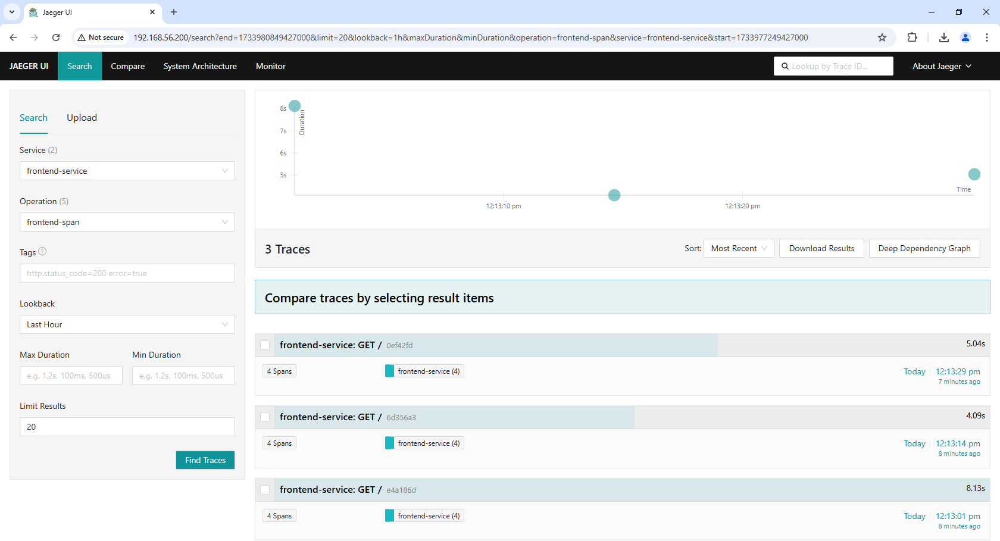
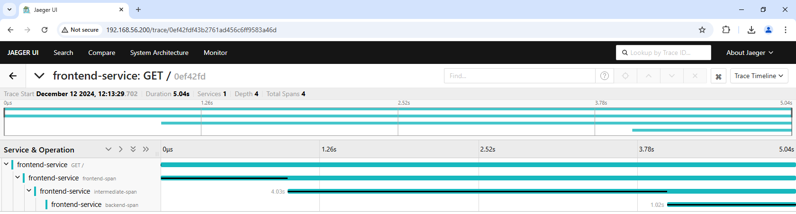

# End-to-End Distributed Tracing Workflow

This project demonstrates an end-to-end distributed tracing workflow using:

- **Kubernetes Cluster**
- **Jaeger**
- **OpenTelemetry**
- **Elasticsearch**
<p align="center">
  
</p>

### Step 1: Deploy Kubernetes Cluster

Set up a Kubernetes cluster with one master and three worker nodes on a VM. Verify the cluster:

```bash
vagrant@master-node:~$ kubectl get nodes -o wide
NAME            STATUS     ROLES           AGE   VERSION    INTERNAL-IP     EXTERNAL-IP   OS-IMAGE             KERNEL-VERSION       CONTAINER-RUNTIME      
master-node     Ready      control-plane   23h   v1.29.12   192.168.56.10   <none>        Ubuntu 22.04.4 LTS   5.15.0-102-generic   containerd://1.7.24    
worker-node01   Ready   <none>          23h   v1.29.12   192.168.56.11   <none>        Ubuntu 22.04.4 LTS   5.15.0-102-generic   containerd://1.7.24    
worker-node02   Ready   <none>          23h   v1.29.12   192.168.56.12   <none>        Ubuntu 22.04.4 LTS   5.15.0-102-generic   containerd://1.7.24    
worker-node03   Ready   <none>          23h   v1.29.12   192.168.56.13   <none>        Ubuntu 22.04.4 LTS   5.15.0-102-generic   containerd://1.7.24    
vagrant@master-node:~$
```
### Step 2: Deploy Elasticsearch

Set up Elasticsearch on a separate VM by following the steps in [this guide](https://www.digitalocean.com/community/tutorials/how-to-install-and-configure-elasticsearch-on-ubuntu-22-04). 

#### Modify /etc/elasticsearch/elasticsearch.yml
```bash
network.host: 192.168.56.85
http.port: 9200
discovery.type: single-node
```
Checks the status of Elasticsearch:
```bash
vagrant@elasticsearch:~$ curl -X GET 'http://192.168.56.85:9200/_cluster/health?pretty'
{
  "cluster_name" : "elasticsearch",
  "status" : "yellow",
  "timed_out" : false,
  "number_of_nodes" : 1,
  "number_of_data_nodes" : 1,      
  "active_primary_shards" : 23,    
  "active_shards" : 23,
  "relocating_shards" : 0,
  "initializing_shards" : 0,       
  "unassigned_shards" : 20,        
  "delayed_unassigned_shards" : 0, 
  "number_of_pending_tasks" : 0,
  "number_of_in_flight_fetch" : 0,
  "task_max_waiting_in_queue_millis" : 0,
  "active_shards_percent_as_number" : 53.48837209302325  
}
vagrant@elasticsearch:~$ 
```

### Step 3: Install Jaeger

Deploy Jaeger using Helm and configure it to use the Elasticsearch backend by following the steps in [this guide](https://github.com/jaegertracing/helm-charts/tree/main/charts/jaeger):

```bash
helm repo add jaegertracing https://jaegertracing.github.io/helm-charts
helm install jaeger jaegertracing/jaeger \
  --set provisionDataStore.cassandra=false \
  --set storage.type=elasticsearch \
  --set storage.elasticsearch.host=<HOST> \
  --set storage.elasticsearch.port=<PORT>  \
  --set agent.resources.requests.memory="512Mi" \
  --set agent.resources.requests.cpu="500m" \
  --set agent.resources.limits.memory="1Gi" \
  --set agent.resources.limits.cpu="1" \
  --set query.resources.requests.memory="512Mi" \
  --set query.resources.requests.cpu="500m" \
  --set query.resources.limits.memory="1Gi" \
  --set query.resources.limits.cpu="1" \
  --set collector.resources.requests.memory="512Mi" \
  --set collector.resources.requests.cpu="500m" \
  --set collector.resources.limits.memory="1Gi" \
  --set collector.resources.limits.cpu="1" \
  --set ui.resources.requests.memory="512Mi" \
  --set ui.resources.requests.cpu="500m" \
  --set ui.resources.limits.memory="1Gi" \
  --set ui.resources.limits.cpu="1"

```
> **Note**: We can modify the resource limits based on our machine's capacity.

```bash
vagrant@master-node:~$ kubectl get pods -o wide
NAME                               READY   STATUS    RESTARTS   AGE   IP               NODE            NOMINATED NODE   READINESS GATES
jaeger-agent-286vs                 1/1     Running   0          20h   172.168.191.68   worker-node03   <none>           <none>
jaeger-agent-wv98r                 1/1     Running   0          20h   172.168.158.3    worker-node02   <none>           <none>
jaeger-agent-xx2fm                 1/1     Running   0          20h   172.168.77.134   master-node     <none>           <none>
jaeger-collector-bb67959cc-fw4hm   1/1     Running   0          20h   172.168.77.135   master-node     <none>           <none>
jaeger-query-7d49f97f66-cs6vz      2/2     Running   0          20h   172.168.77.133   master-node     <none>           <none>
vagrant@master-node:~$ 
```
```bash
vagrant@master-node:~$ kubectl get svc -o wide
NAME               TYPE           CLUSTER-IP       EXTERNAL-IP      PORT(S)                                                                       AGE   SELECTOR
jaeger-agent       LoadBalancer   10.129.237.27    192.168.56.201   5775:31525/UDP,6831:32640/UDP,6832:30208/UDP,5778:31067/TCP,14271:32458/TCP   20h   app.kubernetes.io/component=agent,app.kubernetes.io/instance=jaeger,app.kubernetes.io/name=jaeger
jaeger-collector   ClusterIP      10.129.170.175   <none>           14250/TCP,14268/TCP,14269/TCP                                                 20h   app.kubernetes.io/component=collector,app.kubernetes.io/instance=jaeger,app.kubernetes.io/name=jaeger
jaeger-query       LoadBalancer   10.129.82.214    192.168.56.200   80:32175/TCP,16685:30461/TCP,16687:30304/TCP                                  20h   app.kubernetes.io/component=query,app.kubernetes.io/instance=jaeger,app.kubernetes.io/name=jaeger
kubernetes         ClusterIP      10.129.0.1       <none>           443/TCP                                                                       23h   <none>
vagrant@master-node:~$ 
```
```bash
vagrant@master-node:~$ kubectl get deploy -o wide
NAME               READY   UP-TO-DATE   AVAILABLE   AGE   CONTAINERS                          IMAGES
         SELECTOR
jaeger-collector   1/1     1            1           20h   jaeger-collector                    jaegertracing/jaeger-collector:1.53.0
         app.kubernetes.io/component=collector,app.kubernetes.io/instance=jaeger,app.kubernetes.io/name=jaeger
jaeger-query       1/1     1            1           20h   jaeger-query,jaeger-agent-sidecar   jaegertracing/jaeger-query:1.53.0,jaegertracing/jaeger-agent:1.53.0   app.kubernetes.io/component=query,app.kubernetes.io/instance=jaeger,app.kubernetes.io/name=jaeger
vagrant@master-node:~$ 
```
```bash
vagrant@master-node:~$ kubectl get daemonset -o wide
NAME           DESIRED   CURRENT   READY   UP-TO-DATE   AVAILABLE   NODE SELECTOR   AGE   CONTAINERS     IMAGES                              SELECTOR
jaeger-agent   1         1         1       1            1           <none>          20h   jaeger-agent   jaegertracing/jaeger-agent:1.53.0   app.kubernetes.io/component=agent,app.kubernetes.io/instance=jaeger,app.kubernetes.io/name=jaeger
vagrant@master-node:~$ 
```
### Step 4: Install OpenTelemetry

Install OpenTelemetry packages using pip:

```bash
sudo apt update
sudo apt install python3 python3-pip
pip3 install opentelemetry-api opentelemetry-sdk opentelemetry-exporter-jaeger opentelemetry-instrumentation-flask
```

Configure your application to use OpenTelemetry for tracing. Below is a basic example:

```python
from flask import Flask, request
from opentelemetry import trace
from opentelemetry.instrumentation.flask import FlaskInstrumentor
from opentelemetry.exporter.jaeger.thrift import JaegerExporter
from opentelemetry.sdk.trace import TracerProvider
from opentelemetry.sdk.trace.export import BatchSpanProcessor
from opentelemetry.sdk.resources import SERVICE_NAME, Resource

import time
import random

# Initialize Flask app
app = Flask(__name__)

# Set up OpenTelemetry tracer with Jaeger exporter
trace.set_tracer_provider(
    TracerProvider(
        resource=Resource.create({SERVICE_NAME: "frontend-service"})
    )
)

# Configure Jaeger exporter to send traces
jaeger_exporter = JaegerExporter(
    agent_host_name="192.168.56.201",  # Replace with your Jaeger agent host
    agent_port=5775  # Default Jaeger agent port for UDP
)

# Add the Jaeger exporter to the tracer provider
trace.get_tracer_provider().add_span_processor(
    BatchSpanProcessor(jaeger_exporter)
)

# Instrument the Flask application
FlaskInstrumentor().instrument_app(app)

# Create a tracer instance
tracer = trace.get_tracer(__name__)

@app.route('/')
def frontend():
    with tracer.start_as_current_span("frontend-span"):
        print("Frontend span created!")  # Debugging line
        time.sleep(random.randint(1, 3))  # Simulate work

        # Simulate a call to the intermediate service (internal call)
        intermediate_response = intermediate_internal()
        return f"Frontend Service says: {intermediate_response}"

def intermediate_internal():
    with tracer.start_as_current_span("intermediate-span"):
        print("Intermediate span created!")  # Debugging line
        time.sleep(random.randint(1, 3))  # Simulate work

        # Simulate a call to the backend service (internal call)
        backend_response = backend_internal()
        return f"Intermediate Service says: {backend_response}"

def backend_internal():
    with tracer.start_as_current_span("backend-span"):
        print("Backend span created!")  # Debugging line
        time.sleep(random.randint(1, 3))  # Simulate work
        return "Hello from Backend Service"

if __name__ == "__main__":
    app.run(host="0.0.0.0", port=5000)

```

---

## Verification

1. Access Jaeger UI:

   Open `http://<jaeger-query>:80` in your browser.

2. Run your instrumented application to generate traces.

3. View traces in the Jaeger UI.
<p align="center">
  
</p>
<p align="center">
  
</p>
<p align="center">
  
</p>
